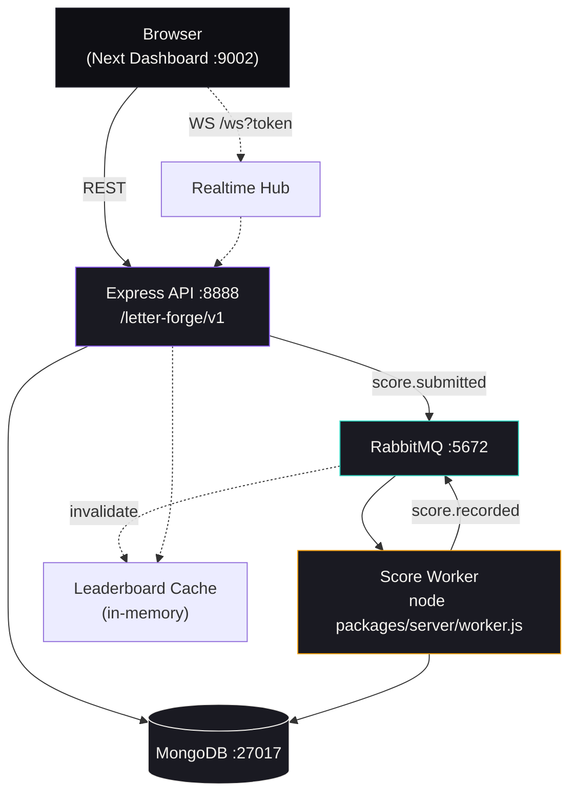
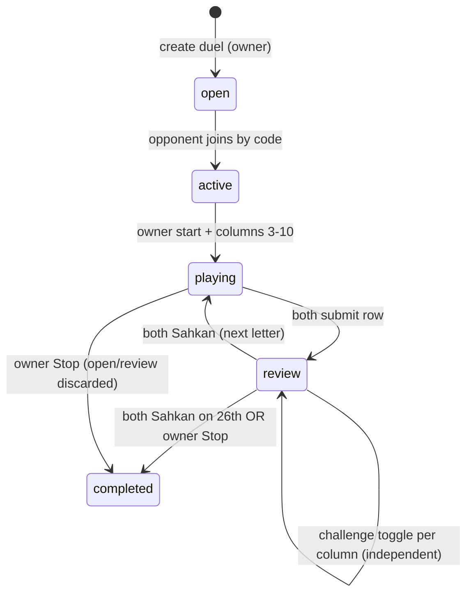
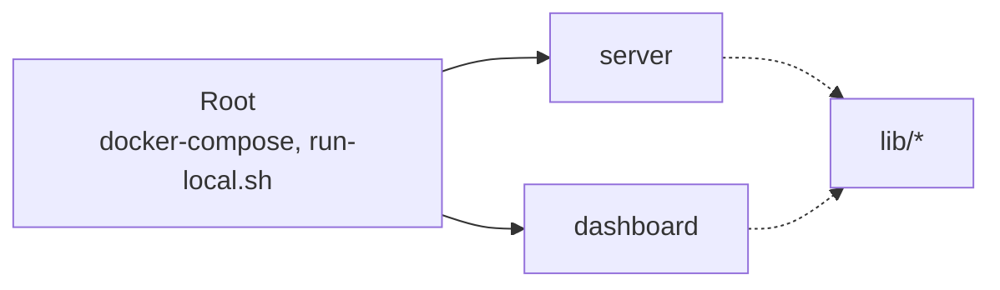
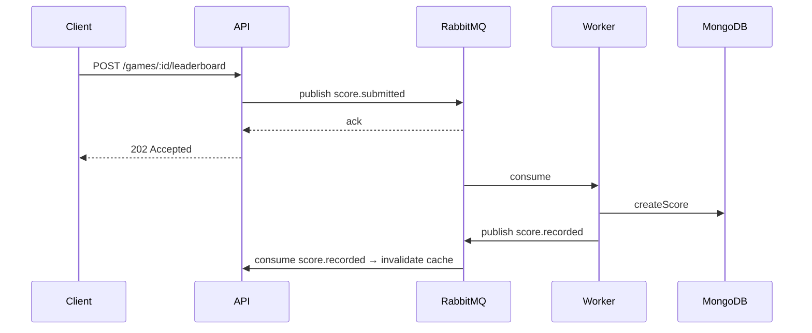
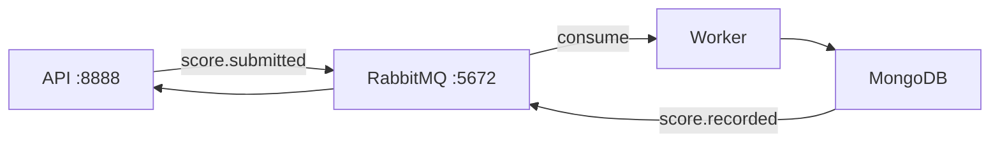

# LetterForge — Technical Documentation

A word game platform where players form words from random letters, earn scores, and compete on leaderboards. Express 5 + MongoDB + RabbitMQ + Next.js 15.

---

## Table of Contents

1. [Overview](#overview)
2. [Monorepo Structure](#monorepo-structure)
3. [Technology Stack](#technology-stack)
4. [System Architecture](#system-architecture)
5. [Quick Start & Networking](#quick-start--networking)
6. [Environment Setup](#environment-setup)
7. [Game Modes](#game-modes)
8. [Wawasan 2020 — Rules & Scoring](#wawasan-2020--rules--scoring)
9. [API Reference](#api-reference)
10. [Database Schema](#database-schema)
11. [Async Score Processing](#async-score-processing)
12. [Development Workflow](#development-workflow)
13. [Testing Strategy](#testing-strategy)
14. [Deployment](#deployment)
15. [Troubleshooting](#troubleshooting)
16. [Contributing](#contributing)

---

## Overview

LetterForge is a full-stack word game. Three layers do one job each: a stateless Express API handles game logic, a background worker persists scores, and a Next.js dashboard renders the game.

**How it works:** create a game, get letters, submit words, get scored, complete, and rank. Every mode reuses the same loop — the mode decides the constraints (rounds, timer, lives, chain rule, or a shared sheet).

**What you get:** real-time validation and scoring, multiple rule sets, async persistence that never blocks the request, leaderboards with cache invalidation, and OpenAPI docs.

---

## Monorepo Structure

```
letterforge-app/
├─ index.html                    # Landing page — hero, modes, how-to-play, sample round
├─ packages/
│  ├─ server/                    # Backend — Express 5, CommonJS, Node 24+
│  │  ├─ modules/
│  │  │  ├─ duels/               # Duels + Wawasan 2020 (service/route, 26-letter sheet)
│  │  │  ├─ game/                # Solo games + daily_challenge (dailyMeanings)
│  │  │  ├─ realtime/            # WS hub (/ws?token=) + polling fallback
│  │  │  ├─ scores/ scoring/     # Async producer/consumer
│  │  │  ├─ leaderboards/ users/ auth/ dictionary/ words/
│  │  ├─ utilities/              # mongodb, env, constant, daily-challenge (buildDailyPool)
│  │  ├─ swagger/ tests/ scripts/
│  │  ├─ .env.example  package.json  Dockerfile
│  └─ dashboard/                 # Frontend — Next 15, React 19, TS, Tailwind + shadcn/Radix
│     ├─ src/app/ (layout, page, play, duels)  src/components/ (GameBoard, DuelBoard, WawasanBoard, FadeTimer)
│     ├─ src/lib/api.ts  src/lib/realtime.ts  src/types/  src/context/
│     └─ .env.example  next.config.ts
├─ docker-compose.yaml           # server, worker, dashboard, rabbitmq, mongodb
├─ Dockerfile                    # npm ci, CMD node packages/server/app.js
├─ run-local.sh                  # start/stop/logs/status + docker helpers
├─ tsconfig.base.json  package.json (workspaces: packages/*, lib/*)
└─ README.md
```

**Decisions:** CommonJS backend for Express 5 simplicity, ESM frontend via Next. Native MongoDB driver (no ORM). Worker decoupled from request thread.

---

## Technology Stack

| Layer | Tech | Version | Use |
|-------|------|---------|-----|
| Runtime | Node.js | 24+ | `node:24-alpine` in Docker |
| Pkg | npm workspaces | 10+ | `lib/*` reserved |
| Backend | Express | 5.x | REST, helmet/cors/rate-limit |
| DB | MongoDB | 7 | Native driver only |
| Queue | RabbitMQ | 3 / management-alpine | `score.submitted` → worker → `score.recorded` |
| Frontend | Next.js | 15.x | App Router, SSR |
| React | | 19.x | Hooks, Suspense |
| UI | shadcn/ui + Radix | — | Tailwind 3, lucide-react |
| Lang | TypeScript | 5.x | Dashboard strict |
| Test | Mocha + Chai + Sinon | — | `npm test --timeout 10000 --exit` |
| Docs | swagger-autogen + swagger-ui | — | `/{ROUTE_PREPEND}/{VERSION}/api-docs` |

---

## System Architecture

### High-Level



### Wawasan 2020 States



### Monorepo deps



---

## Quick Start & Networking

### Prereqs

- Node 20+, npm, Docker & Compose (for Mongo/RabbitMQ), `mongosh` optional.

### Install

```bash
git clone <repo-url> && cd letterforge-app
npm install
```

### Run locally (recommended)

```bash
./run-local.sh start   # server + dashboard + worker + auto-start Mongo/RabbitMQ if needed
./run-local.sh logs    # server/dashboard/worker tails
./run-local.sh status  # PID checks
./run-local.sh stop    # kills by PID + lsof fallback on derived ports
```

What it does:

1. Checks Node/npm, loads root `.env` if present.
2. `wait_for_mongodb` / `wait_for_rabbitmq` — `nc -z localhost:27017|5672` (RabbitMQ auto `docker compose up -d rabbitmq` if down, then wait 30s).
3. `npm install`, ensure `packages/server/.env` from `.env.example`.
4. Runs `packages/server/scripts/bootstrap.sh` (idempotent mongo/rabbitmq ensure, swagger gen).
5. Starts: `NODE_ENV=local npm run dev` (server, **no PORT override**), `npm run dev` (dashboard, uses its own `next dev -p 9002`), `npm run start:worker` (score consumer, logs to `logs/worker.log`).

Endpoints (single source):

```
API_BASE_ENDPOINT=http://localhost:8888/letter-forge/v1   # also WS at /ws
API_DOCS_ENDPOINT=http://localhost:8888/letter-forge/v1/api-docs
DASHBOARD_ENDPOINT=http://localhost:9002
```

- Change a port? Edit the service config (`packages/server/.env:PORT`, `dashboard/package.json: next dev -p`) **and** the endpoint vars above — they must match. Ports are derived from endpoints only to locate stale listeners on `stop`.

### Network (non-localhost)

Both binds are `0.0.0.0` (`next dev -H 0.0.0.0`, Express `0.0.0.0`). From another device on same LAN:

```
Dashboard: http://<LAN-IP>:9002   # e.g. 192.168.100.4:9002
API:       http://<LAN-IP>:8888/letter-forge/v1
```

Dashboard `lib/api.ts` + `lib/realtime.ts` ignore loopback `NEXT_PUBLIC_API_URL` and derive `http://<page-hostname>:8888` + `API_BASE`. CORS is `origin: '*'` — LAN works without config.

**Open the network:** `run-local.sh` prints only localhost; for LAN:

```bash
sudo ufw allow 8888/tcp
sudo ufw allow 9002/tcp
curl http://<LAN-IP>:8888/letter-forge/v1  # should return JSON, not hang
```

If `8888` is squatted (nginx `demo` → `502`), `sudo rm /etc/nginx/sites-enabled/demo && sudo nginx -t && sudo systemctl reload nginx`.

### Docker

```bash
docker compose up -d --build   # server, worker, rabbitmq, mongodb (dashboard via compose if included)
docker compose logs -f
docker compose down
./run-local.sh docker          # same, via helper
```

Root image: `npm ci` from committed `package-lock.json`, `CMD ["node","packages/server/app.js"]`. Worker is same image, `command: ["node","packages/server/worker.js"]`.

---

## Environment Setup

### Backend `packages/server/.env` (from `.env.example`)

```bash
NODE_ENV=local
HOSTNAME=localhost
ROUTE_PREPEND=letter-forge
VERSION=v1
PORT=8888
MONGO_URI=mongodb://localhost:27017/
MONGODB_DBNAME=data
JWT_SECRET=letterforge-dev-secret-change-me
JWT_EXPIRES_IN=7d
RABBITMQ_ENABLED=true
RABBITMQ_URI=amqp://localhost
RABBITMQ_QUEUE_SCORES=score.submitted
RABBITMQ_QUEUE_SCORE_RECORDED=score.recorded
RABBITMQ_PREFETCH=10
```

### Frontend `packages/dashboard/.env.local`

```bash
NEXT_PUBLIC_API_URL=http://localhost:8888   # loopback is ignored on LAN, derived from page host
NEXT_PUBLIC_API_BASE=/letter-forge/v1
```

Never commit `.env`.

---

## Game Modes

| Mode | Key | Rounds | Letters | Lives | TTL | Notes |
|------|-----|--------|---------|-------|-----|-------|
| Normal | `normal_mode` | 10 | 3 | — | — | Classic, untimed, batch 10 |
| Time Attack | `time_attack` | ∞ | 3 | — | 60s | `Timer` → `handleComplete` on expire |
| Survival | `survival_mode` | ∞ | 4 | 5 | — | Wrong word −1 life, `lives` UI in GameBoard |
| Chain | `chain_mode` | 10 | 2 | — | — | `lastLetter` chain via localStorage |
| Fade | `fade_mode` | 10 | 3 | — | 3s | `FadeTimer` 50ms tick, `animate-fade-out`, `restartKey` |
| Daily Challenge | `daily_challenge` | 5 | 0 | — | — | Clue from `dailyMeanings` (see below), `5` tries |
| **Wawasan 2020** | `wawasan_mode` | **26** | — | — | — | **Duel-only**, see next section |

`duels/service.js` allowlist for `startDuel`: `normal_mode,time_attack,survival_mode,chain_mode,wawasan_mode` (excludes `fade_mode`,`daily_challenge`).

---

## Wawasan 2020 — Rules & Scoring

**Theme:** Malaysian paper classic, A4 cream stock, blue rules, red margin, typewriter ink, classic emoji, old-school. Board is the sheet — rows are letters, columns are categories.

**Setup (owner only):**
- Owner creates duel, opponent joins by same 4–8 code (`ABCDEFGHJKLMNPQRSTUVWXYZ23456789`).
- Owner picks **3–10** columns, free text, bilingual presets (`Makanan/Food`, `Minuman/Drinks`, `Negara/Country`, `Negeri/State`, `Nama Orang/Name`, `Haiwan/Animal`, `Buah/Fruits`, `Pekerjaan/Occupation`, `Bandar/City`, `Kenderaan/Vehicle` …) or anything. Duplicate names rejected. Presets are suggestions only — input is fully custom.

**Board:**
- `A–Z` shuffled once (`shuffledAlphabet` via `crypto.randomInt`) → `wawasan.letters[26]`, shared order.
- One row per letter, one column per category. Header shows `columns`, `pointsPerColumn = Math.round(100 / cols)` whole numbers only (e.g. 3→33, 4→25).

**Flow (no timer):**
1. Row shows current letter (e.g. `M`). Each column: type a word starting with that letter, or press **Skip / Langkau** (empty string). Multi-word allowed: `ais kosong`, `teh o ais` (validated `value[0].toLowerCase() === letter.toLowerCase()`, max 50 chars).
2. Press **Hantar**. Your answers are stored per slot (`challenger`/`opponent`). Opponent's open-row answers stay `null` until both submit (no peeking).
3. When **both** submit → row status `review`. Both sheets are revealed side-by-side.
4. **Review:** per column, each player can independently **toggle** opponent's answer invalid — `Tandakan tidak sah` ↔ `Batal — anggap sah`. Independent per column (Set-based `challengingCols`), does not affect other columns. `✓ Sahkan` per player; when **both** `confirmed` → row `done`, next letter opens. With 26 done → duel `completed`. Owner can `Stop` anytime — open/review row discarded, only `done` rows count.

**Scoring (independent per player, per column):**

```
pointsPerCol = Math.round(100 / colCount)   # whole only
normalize = trim + lower + collapse(/\s+/ → " ")   # "teh  O  ais" == "teh o ais"

For each done row, for each column i:
  a = normalize(challenger[i]), b = normalize(opponent[i])
  aChallenged = challenges.opponent[i]   # opponent marked your answer invalid
  bChallenged = challenges.challenger[i] # you marked opponent invalid

  challenger scores if: a && !aChallenged && (!b || a !== b)
  opponent   scores if: b && !bChallenged && (!a || b !== a)

  # empty/skip → 0 for skipper only
  # same word  → 0 both
  # different  → full column pts for each non-challenged valid answer
  # skip doesn't penalize opponent — full sheet (3/3) → 99 vs 66 for 2/3
  # challenge only penalizes the challenged player for that column
```

Winner = higher total (`draw` on tie). Walkthrough dialog (`wawasan-walkthrough-seen-v1`) explains all steps.

**Endpoints:** `POST /duels/:id/start {mode:"wawasan_mode", columns:[…]}`, `POST /:id/wawasan/answer {answers: string[]}`, `POST /:id/wawasan/challenge {columnIndex}`, `POST /:id/wawasan/confirm`, `POST /:id/wawasan/stop` (owner).

---

## API Reference

Base `http://localhost:8888/letter-forge/v1`, docs `/api-docs`.

### Games

| Method | Endpoint | Auth | Purpose |
|--------|----------|------|---------|
| `POST` | `/games` | optional | Create solo game `{mode, letterCount?, letterBatch?}` |
| `GET` | `/games/:id` | optional | Load game (hides `dailyAnswer` until completed) |
| `POST` | `/games/:id/submit` | optional | Submit word `{word}` → scoring, new letters |
| `POST` | `/games/:id/reset` | optional | New letters for time_attack |
| `POST` | `/games/:id/batch` | optional | Refill batch at index ≥8 (normal/time/fade) |
| `POST` | `/games/:id/complete` | optional | Finalize |
| `GET` | `/games/:id/result` | optional | Final result |
| `POST` | `/games/:id/leaderboard` | required | Submit score (202 async or sync fallback) |
| `DELETE` | `/games/:id` | optional | Delete abandoned in-progress game |
| `GET` | `/challenge/today` | — | Today's `{date, clue, meanings[], attempts:5, seed}` (word stripped) |

**Daily payload:** `buildDailyPool` now collects **all** `MEANINGS` per word (4–12 letters, filtered `letter of alphabet`), `getTodayChallenge` returns `meanings: string[]` + `clue: meanings[0]`. Game stores `dailyMeanings` and `dailyAnswer`.

### Duels + Wawasan

| Method | Endpoint | Auth | Purpose |
|--------|----------|------|---------|
| `POST` | `/duels` | required | Create duel `{code?, letterCount?, opponentId?}` |
| `GET` | `/duels/:id` | optional | Public view + `myGameId`, `wawasan` if any |
| `POST` | `/duels/:id/enter` | required | Enter by id |
| `POST` | `/duels/join` | required | Join by `{code}` — creates if not exists |
| `GET` | `/duels/code/:code` | optional | Preview by code |
| `POST` | `/duels/:id/start` | required (owner) | Start `{mode, columns?}` — deals games or opens wawasan sheet |
| `POST` | `/duels/:id/reset` | required | New shared letters for both games (not wawasan) |
| `POST` | `/duels/:id/submit` | required | Submit completed game score (`{gameId}`) |
| `POST` | `/duels/:id/wawasan/answer` | required | Row answers `string[]` (empty = skip) |
| `POST` | `/duels/:id/wawasan/challenge` | required | Toggle column `{columnIndex}` |
| `POST` | `/duels/:id/wawasan/confirm` | required | Confirm review |
| `POST` | `/duels/:id/wawasan/stop` | required (owner) | Stop, discard open/review |
| WS | `/ws?token=` | JWT | `subscribe {duelId}`, `ping`/`pong`, `duel:update` (30s heartbeat, 10s pong timeout, 1.5× backoff) |

### Leaderboard / Scores / Users / Meta

| Method | Endpoint | Purpose |
|--------|----------|---------|
| `GET` | `/leaderboard?mode=&period=&limit=&offset=` | Top scores |
| `GET` | `/leaderboard/rank/:userId?mode=&period=` | Rank |
| `POST` | `/scores` | Create score (via worker) |
| `GET` | `/scores/...` | By game/user |
| `GET` | `/users/:id`, `PUT` | Profile |
| `GET` | `/health`, `/api-docs` | Health, Swagger |

Example — Wawasan start:

```bash
curl -X POST http://localhost:8888/letter-forge/v1/duels/<id>/start \
  -H "Authorization: Bearer <jwt>" -H "Content-Type: application/json" \
  -d '{"mode":"wawasan_mode","columns":["Makanan","Minuman","Negara"]}'
```

---

## Database Schema

### `games` (solo + daily)

```json
{
  "_id": ObjectId,
  "mode": "normal_mode | time_attack | ... | daily_challenge",
  "letterCount": 0, "letters": [], "letterBatch": [["a","b","c"], ...], "batchIndex": 0,
  "userId": ObjectId, "score": 0, "round": 1, "maxRounds": 10,
  "lives": 5, "maxLives": 5, "lastLetter": "a",
  "dailyAnswer": "meridional", "clue": "of or relating to a meridian", "dailyMeanings": ["of or relating...", "located in the south..."],
  "submissions": [{"word":"rate","points":10}], "usedWords": ["rate"],
  "isCompleted": false, "createdAt": Date, "expiresAt": Date
}
```
Public view hides `dailyAnswer` until `isCompleted`.

### `duels`

```json
{
  "_id": ObjectId, "code": "FORGE1", "mode": "wawasan_mode | normal_mode ...",
  "letterCount": 3, "letters": ["a","b","c"], "letterBatch": [["a","b","c"], ...], "maxRounds": 26,
  "status": "open|active|playing|completed", "result": "challenger|opponent|draw", "winnerId": ObjectId,
  "challenger": {"userId": ObjectId, "gameId": ObjectId, "score": 0, "submittedAt": Date, "lastActiveAt": Date, "disconnectedAt": Date, "forfeited": bool},
  "opponent": {"...": "..."},
  "wawasan": {
    "columns": ["Makanan","Minuman","Negara"], "letters": ["M","R","T", ...26], "currentRound": 0,
    "pointsPerColumn": 33,
    "rounds": [{"letter":"M","status":"open|review|done","answers":{"challenger":["mee","","malaysia"],"opponent":["mee","milo",null]},"submitted":{"challenger":true,"opponent":false},"challenges":{"challenger":{"2":true}},"confirmed":{"challenger":false,"opponent":false}}],
    "stoppedAt": Date
  },
  "startedAt": Date, "createdAt": Date, "updatedAt": Date
}
```
Public view masks open-row opponent answers as `null` until both submit; review shows both; `myGameId` per caller.

Indexes: `code unique`, `challenger.userId`, `opponent.userId`, `status`.

### Other collections

`scores` (final persisted scores), `users` (`_id, email, nickname, milestones[]`), `leaderboard cache` (in-memory).

---

## Async Score Processing





**Degradation:** `RABBITMQ_ENABLED=false` → sync write. Publish failure → exponential backoff reconnect. Queue is durable, `prefetch` configurable.

Config: `RABBITMQ_URI`, `RABBITMQ_QUEUE_SCORES`, `RABBITMQ_QUEUE_SCORE_RECORDED`, `RABBITMQ_PREFETCH`, `RABBITMQ_RECONNECT_DELAY`.

---

## Development Workflow

```bash
npm install
npm run dev                # server + dashboard concurrently (blue/magenta)
npm run dev:server         # nodemon --watch **/*.js --exec "npm run swagger && node app.js"
npm run dev:worker         # nodemon worker.js
npm run dev:dashboard      # next dev --turbopack -p 9002 -H 0.0.0.0
npm run build              # swagger gen + builds
npm run typecheck          # tsc --noEmit (dashboard strict)
npm run lint               # eslint
npm test                   # mocha --timeout 10000 --exit (server)
npm run swagger            # node swagger/swagger.js → swagger-output.json
```

**run-local.sh** (`start|stop|restart|logs|status|docker|docker-stop|docker-logs`):

- `start` → `wait_for_mongodb` + `wait_for_rabbitmq` (auto `docker compose up -d rabbitmq` if `nc -z` fails), `npm install`, `bootstrap.sh`, `update-milestones.js`, then launch server/worker/dashboard with logs to `logs/*.log`, PID file `logs/app.pid` (also `kill -- -PID` process group, `lsof` fallback).
- `stop` → `stop_on_port` for API/dashboard + PID kill for worker.
- `docker` → `docker compose up -d --build` (server+worker+rabbitmq+mongodb).
- Fixed endpoints: `API_BASE_ENDPOINT`, `DASHBOARD_ENDPOINT` (override via env), `LOG_DIR`, `RABBITMQ_PORT`.

**Code map:**

- Backend `modules/<feature>/index.js` → `module.exports = async (app, config) => mount`.
- Frontend `src/lib/api.ts` (`getApiOrigin` derives `http://<hostname>:8888` when `NEXT_PUBLIC_API_URL` is loopback), `src/lib/realtime.ts` (`/ws`, 30s ping, 1.5× backoff, max 30s), `src/types`, `src/context/UserContext`.

---

## Testing Strategy

```bash
cd packages/server
npm test                          # 147 passing (wawasan 13, duels 20, daily 8, etc.)
npx mocha test/wawasan-test.js    # wawasan only
npx mocha test/duels-test.js
npx mocha test/daily-challenge-test.js
```

- Integration style: live Mongo (`MONGO_URI`), `sinon.stub(mongodb)` where possible.
- Never `.only`.
- Fixtures: `test/wawasan-test.js` covers `shuffled A–Z`, column validation (3–10, unique, 30-char), `review` (masking → reveal), `challenge` toggle independence (`{"0":true,"1":true}` → toggle off `0` leaves `1`), `Sahkan` both required, 26-row auto-complete, multi-word whitespace collapse (`teh o ais` vs `teh  O  ais` same), full-sheet independent scoring (`99 vs 66`), classic endpoints rejected for wawasan.
- Daily: `buildDailyPool` now `meanings[]`, `getTodayChallenge` deterministic, `dailyMeanings` persisted.
- Frontend: `npm run typecheck` (dashboard), `WawasanBoard` `draft[i] ?? ''` keeps inputs controlled, `FadeTimer` updater pure + commit-phase `useEffect` for `onFadeComplete`.

CI example (`.github/workflows/letterforge-check.yaml`):

```yaml
jobs:
  test: { runs-on: ubuntu-latest, services: { mongodb: { image: mongo:7 } }, steps: [checkout, setup-node 24, run: npm install, run: npm test] }
```

---

## Deployment

```bash
docker build -t letterforge-server:latest .                          # npm ci, node packages/server/app.js
docker run -d -e MONGO_URI=mongodb://db:27017/ -e RABBITMQ_URI=amqp://rabbitmq -p 8888:8888 letterforge-server:latest
docker build -t letterforge-dashboard:latest -f packages/dashboard/Dockerfile .
docker run -d -p 9002:9002 letterforge-dashboard:latest
```

Production env: `NODE_ENV=production`, `HOSTNAME`, `PORT`, `MONGO_URI` (Atlas), `RABBITMQ_URI` (CloudAMQP), `JWT_SECRET`, enable TLS, monitoring, rate-limit, CORS frontend domain, Mongo backups, SIGTERM graceful shutdown.

K8s snippet as before (liveness/readiness on `/letter-forge/v1/health`).

---

## Troubleshooting

**Mongo fails:** `mongosh --eval "db.adminCommand('ping')"`, `docker compose logs mongodb`, check `MONGO_URI`.

**RabbitMQ fails:** `docker compose logs rabbitmq`, `http://localhost:15672` (guest/guest), `rabbitmqctl list_queues`.

**Score not on leaderboard:** `npm run dev:worker` logs, `list_queues name messages`, `db.scores.findOne({playerId})`.

**API 500:** `npm run dev:server` logs, `cat packages/server/.env`, `curl http://localhost:8888/letter-forge/v1/health`.

**Frontend can't reach API / CORS null:** Browser `null` = no TCP reach, not headers. Check `ss -tlnp | grep 8888` — nginx `demo` on `8888` → `502` (header-less) surfaces as CORS. `sudo rm /etc/nginx/sites-enabled/demo && sudo nginx -t && sudo systemctl reload nginx`. For LAN, `ufw allow 8888/tcp && ufw allow 9002/tcp`, then `curl http://<LAN-IP>:8888/letter-forge/v1`.

**Controlled input warning / hydration `data-lt-installed`:** `WawasanBoard` now `value={draft[i] ?? ''}` (controlled from first render), `<html suppressHydrationWarning>` silences LanguageTool extension attribute.

**Attempts `6 of 5`:** Fixed — display `Math.min(round, maxRounds) of maxRounds`, and `dailyMeanings` cycling via `Next/Prev` + full list reveal on completion.

---
## Contributing

```bash
git checkout -b feature/wawasan
# edit, ensure npm run typecheck && npm test pass
git commit -m "feat: wawasan independent per-column scoring"
git push origin feature/wawasan
# open PR with clear description
```

Standards: Express input validation, TS props, `npm run lint` + `typecheck`, `ISC` license.

---

## License

ISC — see `packages/server/LICENSE`.

## Support

Open a GitHub issue. Useful: [Express](https://expressjs.com/) · [Next](https://nextjs.org/docs) · [MongoDB](https://docs.mongodb.com/) · [RabbitMQ](https://www.rabbitmq.com/documentation.html) · [Swagger](https://swagger.io/)

